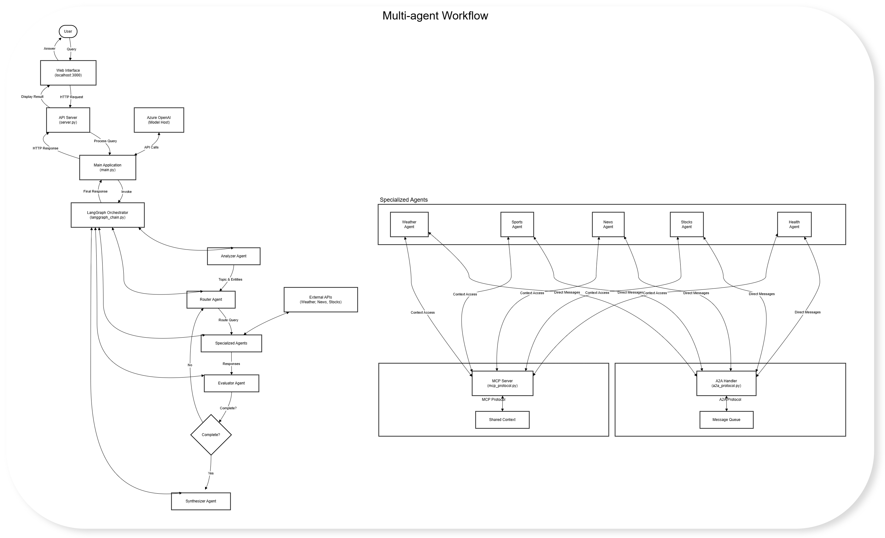

# Multi-Agent Python Application with A2A, MCP and LangGraph

This project demonstrates a multi-agent system using LangGraph, with support for Google's Agent-to-Agent (A2A) protocol and Model Context Protocol (MCP).

## Overview

This multi-agent AI system can answer different types of questions by routing them to specialized agents. Think of it as a team of experts working together where:

- One expert analyzes your question
- Another expert decides who should answer it
- Specialized experts (for weather, sports, news, stocks, or health) provide information
- Another expert evaluates if the answer is complete
- A final expert puts everything together in a nice response

The agents communicate using the A2A protocol, and share contextual information using MCP.

## System Architecture

<!-- Markdown image syntax version (commented out)

-->

*Figure 1: Detailed architecture of the multi-agent system with A2A and MCP protocols*


The architecture diagram above illustrates the flow of information through the multi-agent system:
   
1. **User Layer**: The user interacts with the web interface to submit queries and receive responses.
   
2. **Application Layer**: The API server and main application handle HTTP requests and orchestrate the overall system.
   
3. **LangGraph Orchestration**: The LangGraph component manages the workflow between agents, determining which agents to invoke and when.
   
4. **Agent Layer**: Multiple specialized agents process different aspects of the query:
   - The Analyzer Agent identifies query topics and entities
   - The Router Agent directs queries to appropriate specialized agents
   - Domain-specific agents (Weather, Sports, News, Stocks, Health) provide expert knowledge
   - The Evaluator Agent assesses response completeness
   - The Synthesizer Agent combines information into cohesive responses
   
5. **Communication Protocols**:
   - **A2A Protocol**: Enables direct agent-to-agent messaging for collaboration
   - **MCP Protocol**: Provides shared context across agents to maintain coherent understanding
   
6. **External Integration**: Specialized agents connect to external APIs when needed to fetch real-time data.
   
This architecture enables sophisticated multi-agent collaboration, with agents working together to provide comprehensive answers to complex, multi-domain questions.

## Key Components and Flow

# Multi-Agent Python Application with Agent-to-Agent Communication (MCP)

A Python-based multi-agent system that enables agent-to-agent communication using the Azure OpenAI API. This application demonstrates how multiple specialized AI agents can collaborate to solve complex user queries.

## Features

- **Multiple Specialized Agents**: Weather, News, Sports, Stocks, and general-purpose agents
- **Dynamic Agent Routing**: Automatically routes queries to the most appropriate agents
- **Agent-to-Agent Communication**: Agents can reference and build on each other's responses
- **Conversation History**: Maintains context across multiple user queries
- **Web Interface**: Simple web UI for interacting with the agent network

## New Features in responses-api-implementation Branch

This branch implements the Azure OpenAI Responses API integration for improved agent-to-agent communication:

- **Responses API Support**: Uses the Azure OpenAI Responses API for context references
- **Fallback Mechanism**: Gracefully degrades to standard API when Responses API is not available
- **Enhanced Error Handling**: Improved error handling in both backend and frontend
- **API Version Compatibility**: Configurable API version support with proper error messages

## Prerequisites

- Python 3.9+
- Azure OpenAI Service access (API key and endpoint)
- Optional: API keys for news, weather, stocks services

## Environment Setup

1. Clone the repository
2. Create a virtual environment and activate it:
   ```bash
   python -m venv venv
   source venv/bin/activate  # On Windows: venv\Scripts\activate
   ```

3. Install dependencies:
   pip install -r requirements.txt

4. Configure environment variables:
   Copy app/.env.example to .env
   Update with your Azure OpenAI API key and endpoint
   Add optional service API keys as needed

Important Configuration Notes
   Set AZURE_OPENAI_API_VERSION=2024-05-01-preview for 
   Responses API support
   Set USE_RESPONSES_API=True in config.py to enable
   Responses API features
   Set ENABLE_API_COMPARISON=True to see differences
   between standard and Responses API

1. Running the Application
   Start the server:
   cd app
   python server.py

2. Open a web browser and navigate to http://localhost:3000
3. Enter queries and receive responses from the multi-agent system

Testing
Run the API test script to verify your Azure OpenAI configuration and test the Responses API support:

python test_azure_openai.py

This script will:

   Test standard Chat Completions API functionality
   Test Responses API support if available
   Provide detailed diagnostic information

Responses API Integration Details
The ResponsesApiHandler class in responses_api.py manages:

   Conversation ID tracking for agent threads
   Response reference management
   Fallback to standard API when needed
   Context storage and retrieval

Project Structure
   app: Main application directory
   api/: API endpoints
   agents/: Agent implementations
   chains/: LangGraph chain implementations
   static/: Web UI files
   utils/: Utility functions including Responses API
    handling
   config.py: Global configuration settings
   server.py: Flask server implementation
   tests/: Unit and integration tests
   data: Data storage for conversations and agent memories

Troubleshooting
If you encounter the "[object Object]" error in the UI, check:

The browser console for detailed error messages
   Ensure your Azure OpenAI API version is properly
    configured
   Verify that error responses from the server are properly formatted 
   API Version Compatibility

This project supports both:
   Standard Azure OpenAI Chat Completions API
   Azure OpenAI Responses API (requires API version 2024-05-01-preview or newer)
   The system will automatically detect API support and fall back to standard mode if needed.

Contributing
Contributions are welcome! Please feel free to submit a Pull Request.

License
This project is licensed under the MIT License - see the LICENSE file for details.

